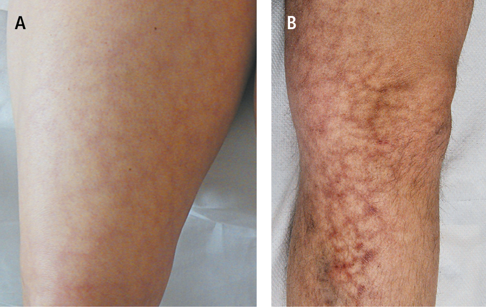

#[I'm a relative reference to a repository file](../blob/master/LICENSE)
# Dermatomyositis

No: 5

# Clinical picture

- **Myalgia**
- Symmetrical weakness of proximal muscles of limb
- **Dysphonia**
- **Heliotropic erythema**
- Fever
- Weight loss
- **Livedo reticularis**

    
